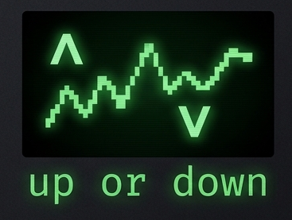

# Polymarket Trading Toolkit

Composable Python toolkit for backtesting and live execution on Polymarket binary prediction markets. Targets 5/15-minute BTC/ETH up-or-down markets with a plugin-based strategy system, vectorized backtesting engine, and production-ready order execution.

> **Disclaimer:** Experimental software. Paper trade first. Never default to live.

---

## What It Does

Polymarket runs 5-minute binary markets — _"Will BTC be higher or lower in 5 minutes?"_ This toolkit automates the full loop:

1. **Fetch** OHLCV candles (Binance with multi-exchange fallback)
2. **Generate signals** via composable strategies and filter gates
3. **Backtest** with parameter sweeps and walk-forward validation
4. **Execute** paper or live orders via the Polymarket CLOB API

---

## Architecture

Six independent packages with strict layering — no circular dependencies:

```
packages/
  core/        → Protocol types (Strategy, Indicator, DataFeed), config, plugin registry
  data/        → OHLCV fetcher (Binance→OKX→Bybit→Gate.io), Parquet storage, CVD/liquidations/funding enrichment
  indicators/  → EMA, SMA, RSI, MACD, Bollinger Bands, ADX, HL Orderflow (pure numpy/pandas)
  strategies/  → Streak reversal, microstructure signals, ML strategy, copytrade + filter gates
  backtest/    → Vectorized engine, parameter sweep, walk-forward validation, metrics
  executor/    → Polymarket CLOB client, WebSocket feed, PaperTrader, LiveTrader, resilience

scripts/
  bots/        → Long-running bot runners (Docker-deployed)
  backtest/    → Sweep and training scripts
  calibrate/   → Gate and parameter tuning
  analysis/    → Post-trade analysis tools
  monitor/     → Live TUI dashboards
  utils/       → Data fetch, wallet, maintenance
```

---

## Strategies

All strategies implement the `Strategy` Protocol — `evaluate(candles, **params) → DataFrame` returning a `signal` column (1=UP, -1=DOWN, 0=skip).

| Strategy | Signal | Best Result |
|---|---|---|
| `StreakReversal` | N consecutive same-direction candles → reversal | **Sharpe 6.60** (ETH/5m + TrendFilter) |
| `StreakADX` | Streak reversal filtered by ADX trend strength | — |
| `ApexHybridStrategy` | Streak + TFI exhaustion confirmation | Sharpe 6.54 (ETH/5m) |
| `ApexMLStrategy` | Walk-forward logistic regression, 12 microstructure features | — |
| `HLOrderflowMomentum` | High-low orderflow momentum | — |
| `HLOrderflowReversal` | High-low orderflow reversal | — |
| `ThreeBarMomo` | Three-bar directional momentum | — |
| `PinBar` | Pin bar rejection reversal | — |
| `DeltaFlip` | CVD delta direction flip | — |
| `CVDDivergence` | Price/volume divergence | — |
| `LiquidationCascade` | Cascading liquidation entries | — |
| `CopytradeStrategy` | Event-driven wallet copytrade | — |

**Gates** (signal vetoes): `TrendFilter` · `VolatilityGate` · `VolumeFilter` · `SessionFilter`

Best confirmed gate: `TrendFilter(ema_period=50, mode="veto_with_trend")` on ETH/5m.

**Currently deployed bots:** streak_reversal+trend (ETH/5m), streak_adx (ETH/5m), HL orderflow momentum/reversal (BTC/5m+15m), three-bar momentum (BTC/5m), pin bar (BTC/5m), delta flip (BTC/5m).

---

## Backtesting

The engine simulates Polymarket's binary mechanic: fixed ~50¢ entry, ~5% fee, binary resolution. Key features:

- **Parameter sweep:** Tests all combinations from each strategy's `param_grid`
- **Walk-forward:** Train on window N, test on window N+1 (prevents overfitting)
- **Intrabar-conservative scoring:** Spike candles that reversed intrabar are marked as losses
- **Gate sweep:** `sweep_gates.py` finds optimal filter combinations

---

## Execution

- **PaperTrader** — Full simulation with trade logging (default)
- **LiveTrader** — FOK orders via Polymarket CLOB API, quarter-Kelly sizing, daily bet/loss limits
- **WebSocket feed** — Real-time orderbook + trade events (~100ms latency), REST fallback on every path
- **Circuit breaker + rate limiter** — Prevents cascading API failures
- **Proxy wallet support** — Separate signing/funding keys via EIP-712

---

## Plugin System

Strategies and indicators are auto-discovered via Python entry points or local drop-ins:

```python
# Entry points (pyproject.toml)
[project.entry-points."polymarket_algo.strategies"]
my_strategy = "my_package.my_strategy:MyStrategy"

# Or drop a file in
~/.polymarket-algo/plugins/my_strategy.py
```

---

## Setup

**Requires:** Python 3.13+, [uv](https://docs.astral.sh/uv/)

```bash
uv sync --all-packages
cp .env.example .env
prek install          # optional: git hooks (ruff + typecheck)
```

**With Nix:**
```bash
nix develop           # auto-runs uv sync + prek install
```

---

## Usage

```bash
# Fetch historical data
uv run python scripts/utils/fetch_data.py

# Backtest with parameter sweep + walk-forward
uv run python scripts/backtest/backtest.py
uv run python scripts/calibrate/sweep_gates.py --walk-forward --cutoff 2024-01-01

# Paper trade
uv run python scripts/bots/streak_bot.py --paper --asset eth --timeframe 5m

# Deploy all bots
docker compose up -d
```

---

## Development

```bash
ruff check packages/ tests/    # lint
ruff format --check packages/  # format
ty check                       # typecheck
uv run pytest -v               # tests
```

---

## License

MIT
