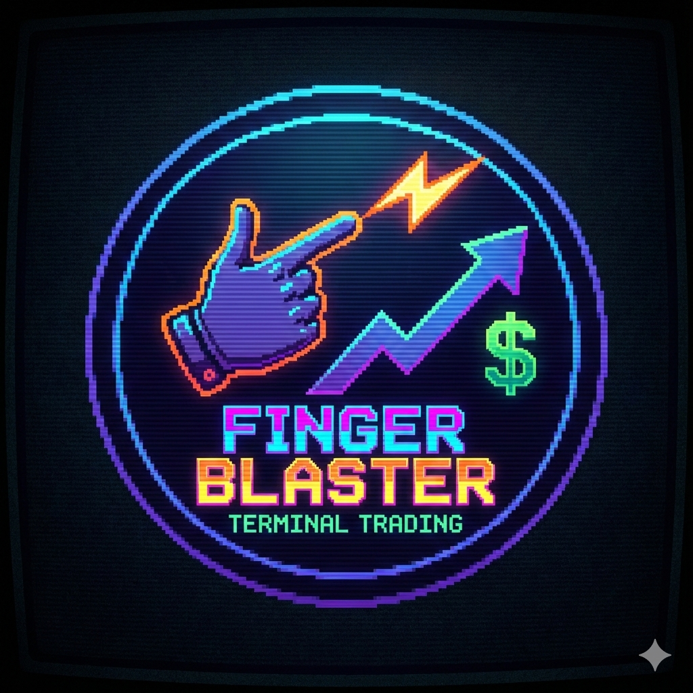

# FingerBlaster

<div align="center">



**Fast terminal trading tools for Polymarket.**

</div>

FingerBlaster is a set of keyboard-driven terminal apps for trading Polymarket's 15-minute BTC Up/Down markets. It is built with [Textual](https://textual.textualize.io/).

| Tool | What it does |
|------|--------------|
| **Activetrader** | One-key trading terminal with live fair-value pricing and edge signals |
| **Ladder** | Depth-of-market ladder for placing and managing orders at any price |
| **Pulse** | Multi-timeframe technical analysis dashboard using Coinbase data |
| **Positions** | View and close open positions |

---

## Requirements

- Python 3.10+
- A Polymarket account with API credentials
- A private key for signing orders
- USDC on Polygon
- Coinbase API credentials (optional, for Pulse only)

## Installation

```bash
git clone <repository-url>
cd finger_blaster
python -m venv venv
source venv/bin/activate        # Windows: venv\Scripts\activate
pip install -r requirements.txt
cp env.example .env
```

Add your credentials to `.env`:

```env
# Required
PRIVATE_KEY=0x...
POLY_API_KEY=...                # https://polymarket.com/settings/api
POLY_API_SECRET=...
POLY_API_PASSPHRASE=...

# Optional: Pulse
COINBASE_API_KEY=...
COINBASE_API_SECRET=...
COINBASE_API_PASSPHRASE=        # Legacy keys only; leave blank for CDP keys
```

`env.example` lists the other optional settings, such as order size limits.

> **Never commit `.env`.** It contains your private key.

---

## Usage

```bash
python main.py                  # Activetrader (default)
python main.py --ladder         # Ladder
python main.py --pulse          # Pulse
python main.py --positions      # Positions
```

### Activetrader

| Key | Action |
|-----|--------|
| `Y` | Buy Up |
| `N` | Buy Down |
| `F` | **Flatten all positions immediately (no confirmation)** |
| `C` | Cancel all orders |
| `+` / `=` | Increase order size by $1 |
| `-` | Decrease order size by $1 |
| `Q` | Quit |

### Ladder

| Key | Action |
|-----|--------|
| `↑` `↓` / `k` `j` | Move cursor |
| `m` | Center on mid-price |
| `y` / `n` | Market buy YES / NO |
| `t` / `b` | Limit buy YES / NO at cursor |
| `x` | Cancel orders at cursor |
| `c` | Cancel all orders |
| `f` | Flatten all positions |
| `+` / `-` | Change order size |
| `?` / `h` | Help |
| `q` | Quit |

### Pulse

```bash
python main.py --pulse --products BTC-USD ETH-USD --timeframes 1m 15m 1h
```

- **Timeframes:** `10s`, `1m`, `5m`, `15m`, `1h`, `4h`, `1d` (default: `1m 5m`)
- **Products:** any Coinbase product ID (default: `BTC-USD`)

Run `python -m src.pulse` directly for more options: `--streaming` (text output, no dashboard), `--verbose`, `--quiet`, `--no-trades`, `--no-candles`.

### Positions

| Key | Action |
|-----|--------|
| `↑` `↓` / `k` `j` | Move cursor |
| `c` / `Enter` | Close selected position |
| `f` | Toggle filter |
| `r` | Refresh |
| `q` / `Esc` | Quit |

---

## Reading Activetrader

Analytics refresh every 500 ms.

| Field | Meaning |
|-------|---------|
| **STRIKE** | The price BTC must beat to resolve Up |
| **BTC** | Live Chainlink BTC/USD price, the same source Polymarket uses to resolve |
| **DIST** | Distance from strike, in dollars and basis points |
| **σ (sigma)** | Distance from strike in standard deviations, adjusted for time left |
| **REMAIN** | Time to expiry. Green is over 5 min, orange is 2–5 min, and red (blinking) is under 2 min |
| **FV** | Fair value from a Black-Scholes binary option model |
| **Edge** | Market price vs. fair value, in bps. The BUY/SELL signal fires above 50 bps |
| **DEPTH / SLIP** | Top-of-book liquidity and estimated slippage for your order size |
| **CASH / POS / PnL** | Available USDC, open positions, and unrealized P&L |

**How sigma is calculated:** `Z = ln(S/K) / (σ√T)`. S is the BTC price, K is the strike, σ is annualized volatility (60% by default), and T is the time left. A positive Z favors Up and a negative Z favors Down. Near 0 is a coin flip, and beyond ±2 is a strong move.

### Pulse signal scores

Each timeframe gets a 0–100 score. 70 or above is bullish, 40–70 is neutral, and below 40 is bearish. Short timeframes weight order flow and candles. Longer ones weight trend and support/resistance.

---

## Configuration

To change Activetrader defaults, edit `src/activetrader/config.py`:

| Setting | Default |
|---------|---------|
| `order_rate_limit_seconds` | 0.5 |
| `min_order_size` / `size_increment` | $1 |
| `analytics_interval` | 0.5 s |
| `default_volatility` | 0.60 |
| `edge_threshold_bps` | 50 |
| `timer_watchful_minutes` / `timer_critical_minutes` | 5 / 2 |
| `oracle_lag_warning_ms` / `oracle_lag_critical_ms` | 500 / 2000 |

Pulse settings live in `src/pulse/config.py` (`PulseConfig`).

---

## Troubleshooting

Logs are written to `data/finger_blaster.log`. Check them first.

- **No market data:** Check your network connection and firewall, and confirm the Polymarket API is reachable.
- **Orders fail:** Check `PRIVATE_KEY` and your API credentials, and confirm you have enough USDC on Polygon.
- **Analytics frozen:** The market may have expired, or the BTC price feed may have disconnected.
- **Pulse can't authenticate:** CDP keys need `PyJWT` and `cryptography` installed. Legacy keys need `COINBASE_API_PASSPHRASE`. Your key needs at least View permission.

---

## Security

- Orders are signed locally. Your private key never leaves your machine.
- All network traffic uses HTTPS/WSS.
- Flatten (`F`) acts immediately, with no confirmation.

---

## Project Structure

```
finger_blaster/
├── main.py             # Entry point
├── env.example         # Config template
├── src/
│   ├── activetrader/   # Trading terminal and analytics engine
│   ├── ladder/         # DOM ladder
│   ├── pulse/          # Technical analysis dashboard
│   ├── positions/      # Position manager
│   ├── connectors/     # Polymarket and Coinbase clients
│   └── shared/         # Market discovery
└── tests/
```

---

## License

Provided as-is for personal and educational use. Built on [Textual](https://textual.textualize.io/) and [py-clob-client](https://github.com/Polymarket/py-clob-client).
